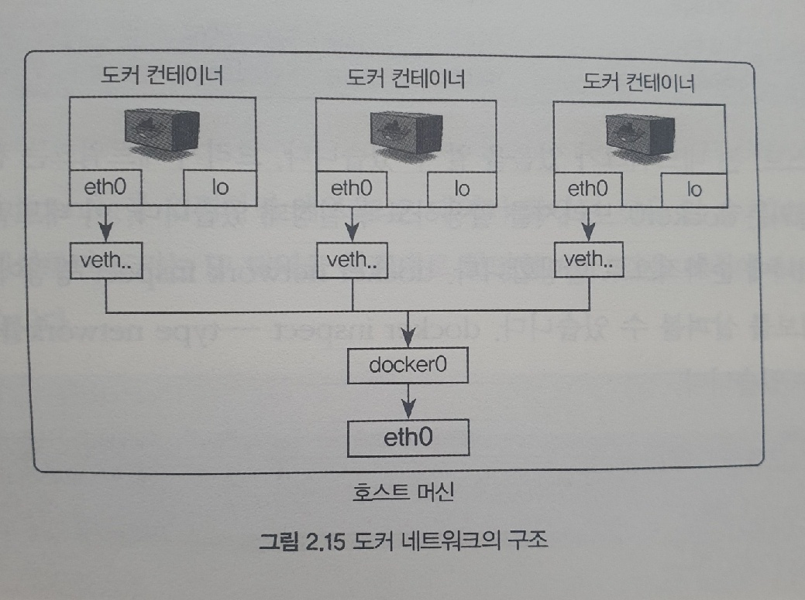
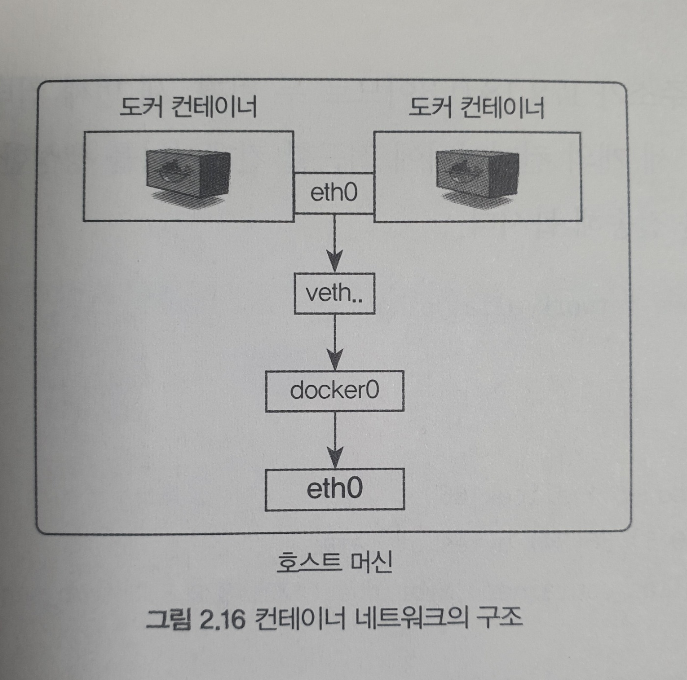

em # 시작하세요! 도커/쿠버네티스

### 친절한 설명으로 쉽게 이해하는 컨테이너 관리

> 네트워크 구조
``` docker
* 컨테이너 네트워크 IP 확인
    [명령어] 
       ifconfig [리눅스 기준]

    도커는 컨테이너에 내부 IP를 순차적으로 할당. 
    컨테이너를 재시작 할때마다 변경될 수 있다.
    내부 IP는 도커가 설치된 호스트, 즉 내부 망에서만 쓸수 있는 IP이다.
    eth0 : 공인 IP 또는 내부 IP가 할당되어 실제로 외부와 통신할 수 있는 호스트의 네트워크 인터페이스
    veth : 가상 네트워크 인터페이스 (컨테이너 생성될때 자동생성)
           즉, 실행 중인 컨테이너 수만큼 veth로 시작하는 인터페이스가 생성 됨
    docker() : 각 veth 인터페이스와 바인딩 돼어 호스트의 eth() 인터페이스와 이어주는 역할을 함. (브리지)

EX) 
	...	
    docker0: flags=4163<UP,BROADCAST,RUNNING,MULTICAST>  mtu 1500
        inet 172.17.0.1  netmask 255.255.0.0  broadcast 172.17.255.255
        inet6 fe80::42:a3ff:feaa:6eaa  prefixlen 64  scopeid 0x20<link>
        ether 02:42:a3:aa:6e:aa  txqueuelen 0  (Ethernet)
        RX packets 0  bytes 0 (0.0 B)
        RX errors 0  dropped 0  overruns 0  frame 0
        TX packets 5  bytes 526 (526.0 B)
        TX errors 0  dropped 0 overruns 0  carrier 0  collisions 0

    eth0: flags=4163<UP,BROADCAST,RUNNING,MULTICAST>  mtu 1500
        inet 172.27.193.70  netmask 255.255.240.0  broadcast 172.27.207.255
        inet6 fe80::215:5dff:fe9a:5abd  prefixlen 64  scopeid 0x20<link>
        ether 00:15:5d:9a:5a:bd  txqueuelen 1000  (Ethernet)
        RX packets 622  bytes 584919 (584.9 KB)
        RX errors 0  dropped 0  overruns 0  frame 0
        TX packets 360  bytes 67554 (67.5 KB)
        TX errors 0  dropped 0 overruns 0  carrier 0  collisions 0

    lo: flags=73<UP,LOOPBACK,RUNNING>  mtu 65536
        inet 127.0.0.1  netmask 255.0.0.0
        inet6 ::1  prefixlen 128  scopeid 0x10<host>
        loop  txqueuelen 1000  (Local Loopback)
        RX packets 0  bytes 0 (0.0 B)
        RX errors 0  dropped 0  overruns 0  frame 0
        TX packets 0  bytes 0 (0.0 B)
        TX errors 0  dropped 0 overruns 0  carrier 0  collisions 0

    veth400ef08: flags=4163<UP,BROADCAST,RUNNING,MULTICAST>  mtu 1500
        inet6 fe80::d42d:ebff:fea4:cf57  prefixlen 64  scopeid 0x20<link>
        ether d6:2d:eb:a4:cf:57  txqueuelen 0  (Ethernet)
        RX packets 0  bytes 0 (0.0 B)
        RX errors 0  dropped 0  overruns 0  frame 0
        TX packets 3  bytes 266 (266.0 B)
        TX errors 0  dropped 0 overruns 0  carrier 0  collisions 0

    vethf0e3715: flags=4163<UP,BROADCAST,RUNNING,MULTICAST>  mtu 1500
        inet6 fe80::b0d5:c7ff:fec5:3562  prefixlen 64  scopeid 0x20<link>
        ether b2:d5:c7:c5:35:62  txqueuelen 0  (Ethernet)
        RX packets 0  bytes 0 (0.0 B)
        RX errors 0  dropped 0  overruns 0  frame 0
        TX packets 12  bytes 1112 (1.1 KB)
        TX errors 0  dropped 0 overruns 0  carrier 0  collisions 0
	...	
```
> 네트워크 구조 이미지


> 네트워크 기능
``` docker
* 도커가 제공하는 네트워크 드라이버
    bridge, host, none, container, overlay

    bridge : 컨테이너를 생성할때 자동으로 연결되는 docker0 브리지를 활용하도록 설정
    
    네트워크 목록 확인
    [명령어]
       docker network ls (이미 bridgem host, none)이 존재

    네트워크 상세 정보
    [명령어]
       docker network inspect networkID
       docker inspect --tpye network networkID 

* 브리지 네트워크
    docker0 이 아닌 사용자 정의 브리지.

    브리지 네트워크 생성
    [명령어]
       docker network create --driver bridge mybridge
       (서브넷, IP, 게이트웨이 등 임의로 설정하는 방법)
       docker network create --driver=bridge \
       --subnet=172.72.0.0/16 \    (--ip-range 같은대역이어야 함)
       --ip-range=172.72.0.0/24 \  (--subnet 같은대역이어야 함)
       --geteway=172.72.0.1 \
       mybridge

    EX) 
        docker run -i -t --name mynetwork_container \ 
        --net mybridge \ 
        ubuntu:14.04 

    해당 네트워크를 사용하는 컨테이너에서 IP를 확인하면
    새로운 대역의 IP가 할당됨.

    이렇게 생성된 사용자 정의 네트워크는 유동적으로 붙히거나 뗄 수 있다. 
    단, 특정 IP 대역을 갖는 네트워크 모드에서만(브리지 네트워크, 오버레이 네트워크)
    [명령어]
       docker network connect mybridge mynetwork_container
       docker network disconnect mybridge mynetwork_container

* 호스트 네트워크
    호스트의 네트워크 환경을 그대로 사용.

    EX) 
        docker run -i -t --name mynetwork_host \ 
        --net host \ 
        ubuntu:14.04

    컨테이너의 네트워크를 호스트 모드로 설정하면 별도의 포트포워딩 없이 바로 서비스 가능.

* 논 네트워크
    아무런 네트워크를 사용하지 않음. 외부와 연결이 단절

    EX) 
        docker run -i -t --name mynetwork_none \ 
        --net none \ 
        ubuntu:14.04

    컨테이너 내부에서 인터페이스를 확인하면 lo 외에는 존재하지 않음

* 컨테이너 네트워크
    다른 컨테이너의 네트워크 네임스페이스 환경을 공유.
    공유되는 속성은 내부IP, 네트워크 IF의 MAC주소 등

    EX)
        docker run -i -t -d --name network_container_1 ubuntu:14.04

        docker run -i -t -d --name network_container_2 \
        --net container:network_container_1 \
        ubuntu:14.04

        * -i -t -d 옵션
            컨테이너 내부에서 셸을 실행하지만 내부로 들어가지 않고 컨테이너도 종료되지 않음        

        위와 같이 공유하게되면 내부IP를 새로 할당받지 않고
        호스트 veth로 시작하는 가상 네트워크 인터페이스도 생성되지 않는다.

        두 컨테이의 eth()에 대한 정보가 완전히 일치한다.
        아래 그림을 참고.

```

