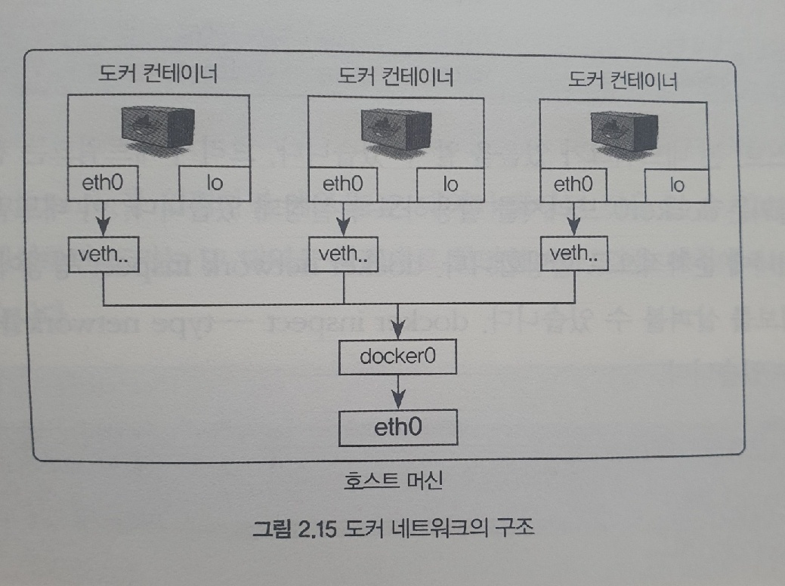

em # 시작하세요! 도커/쿠버네티스

### 친절한 설명으로 쉽게 이해하는 컨테이너 관리

> 네트워크 구조
``` docker
* 컨테이너 네트워크 IP 확인

ifconfig [리눅스 기준]
도커는 컨테이너에 내부 IP를 순차적으로 할당.
eth0 IP는 컨테이너를 재시작 할때마다 변경될 수 있다.
이 내부 IP는 도커가 설치된 호스트, 즉 내부 망에서만 쓸수 있는 IP이다.


EX) 
	...	
    eth0: flags=4163<UP,BROADCAST,RUNNING,MULTICAST>  mtu 1500
        inet 172.27.193.70  netmask 255.255.240.0  broadcast 172.27.207.255
        inet6 fe80::215:5dff:fe9a:54e8  prefixlen 64  scopeid 0x20<link>
        ether 00:15:5d:9a:54:e8  txqueuelen 1000  (Ethernet)
        ...

	lo: flags=73<UP,LOOPBACK,RUNNING>  mtu 65536
        inet 127.0.0.1  netmask 255.0.0.0
        inet6 ::1  prefixlen 128  scopeid 0x10<host>
		...	
```
> 네트워크 구조 이미지
